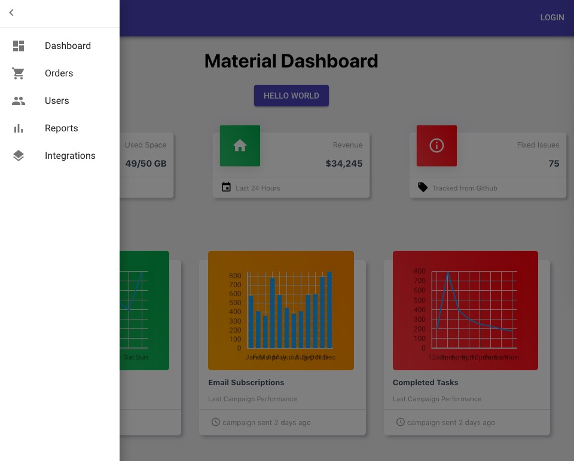

# A mock dashboard page of material ui demo page
This project uses react
    - BrowserRouter, Route and Link are used for client side routing(track history)
    - Matrial-ui components
    - barChart component, charts component, dashboardSide component, downline component, employeesStats component, simpleLine component, slidingBar component, taskTable component and userSide component

## Available Scripts
In the project directory, you can run:
### `npm install` 
install node modules
### `npm start`
start the application

